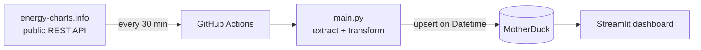

# ⚡ Italian Power Grid — Data Pipeline & Dashboard

Automated pipeline that collects the Italian electricity grid's production mix every 30
minutes into DuckDB / MotherDuck, and answers three questions through a Streamlit dashboard:

- **Sustainability** — how much of Italy's electricity is really renewable, and when is the grid cleanest?
- **Consumption** — when does demand peak, and how do weekends differ from weekdays?
- **Energy security** — how much do we import, and what keeps the lights on when solar drops to zero?

> **Live dashboard:** https://energyconsumes-ezcyeswldexjrwzhsqznts.streamlit.app

## Architecture



Fully serverless, zero cost: GitHub Actions for compute, MotherDuck for storage.

| Layer | Choice | Why |
|---|---|---|
| Source | [energy-charts.info](https://energy-charts.info) API | Public, no auth, real grid data |
| Storage | DuckDB / MotherDuck | Columnar — the right shape for time series |
| Orchestration | GitHub Actions (cron) | Free, versioned with the code, no server |
| Dashboard | Streamlit | Shortest path from SQL to something readable |

## The data

One row per timestamp, 22 columns: full generation mix, total `Load`, cross-border trading,
renewable share. Ingestion is an **upsert on `Datetime`** — recent values get revised, history
is left intact, and running the job twice is a no-op.

- **~2h publication lag.** "Last reading: 2 hours ago" is the API, not a broken pipeline.
- **Mixed granularity.** Today comes at 15 minutes, history at 1 hour — a backfill must reconcile the two.

## Layout

```
main.py               ETL pipeline — run every 30 min by GitHub Actions
query.py              Ad-hoc exploration from the terminal
Streamlit/home.py     Dashboard layout — 3 tabs, one per question
Streamlit/db.py       Connection + all SQL, cached
```

All SQL lives in `db.py`, and aggregation is done by DuckDB rather than pandas — so the
queries still work when the table holds years instead of days.

## Running it

```bash
python -m venv venv && source venv/bin/activate
pip install -r requirements.txt
python main.py                      # fetch and store
streamlit run Streamlit/home.py     # open the dashboard
```

Runs against a local DuckDB file with no configuration. For MotherDuck, put
`MOTHERDUCK_TOKEN=...` in `.env` (gitignored; the same value is set as a repository secret).

## Roadmap

- [ ] **Historical backfill** via the API's `start`/`end` — the main limitation today
- [ ] Deploy to Streamlit Community Cloud
- [ ] Data quality checks + alert on job failure
- [ ] Transformation layer between raw and dashboard
- [ ] Tests
